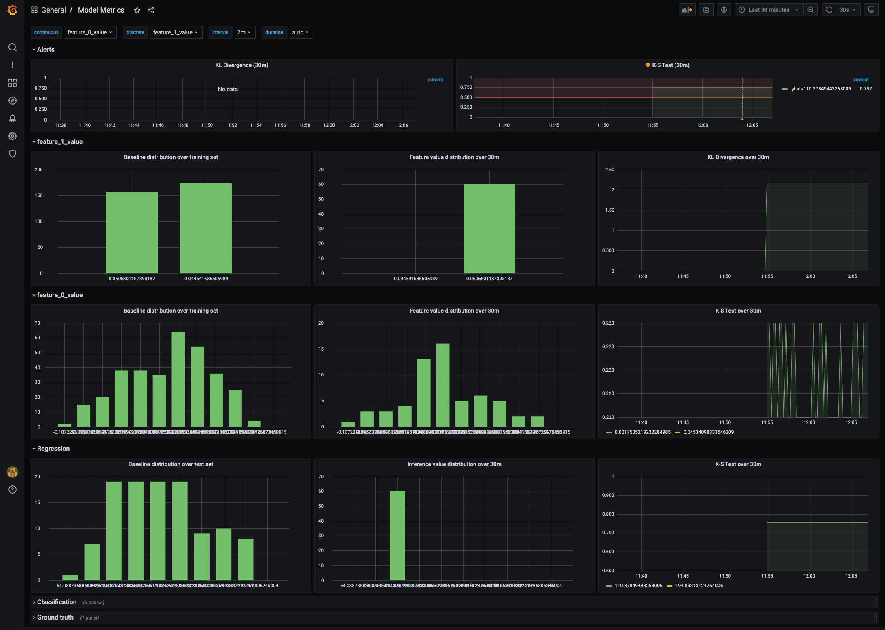
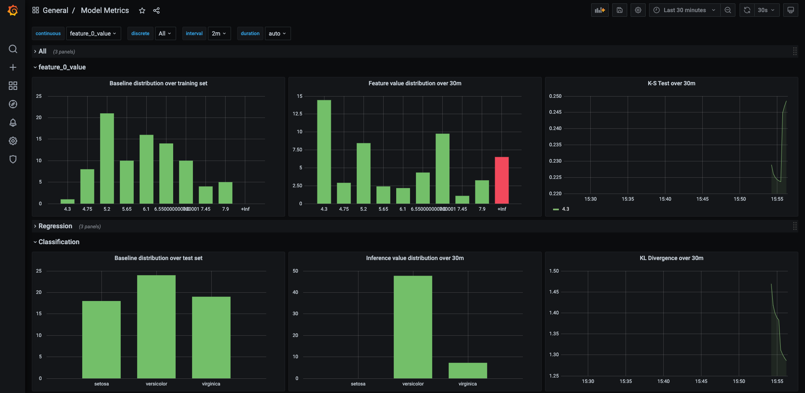

<p align = "center" draggable=”false” >
</p>

# <h1 align="center" id="heading">Monitoring Drift</h1>


## Background
*Please review the weekly narrative [here](https://www.notion.so/Week-14-MLOps-Pipelines-Monitoring-and-Automation-639b4ef5787c4abb81bf3f8a2ca9845c#8072a14879674a8dbb37d140406f003f)*

It's important to continously monitor your models as to keep track of data and model drift. A good example of what happens when note monitoring is [Tay](https://en.wikipedia.org/wiki/Tay_(bot)), a chatter bot on twitter that went from giving pleasant greetings to tweeting explicit and racist remarks in under 16 hours by learning off of others. To make sure our model is always focusing on the features we're interested and keeping a consistent behavior in its predictions, we need monitoring.

Today we'll be taking a look at ML monitoring using [Boxkite](https://github.com/boxkite-ml/boxkite) to easily visualize monitoring metrics using [Prometheus](https://prometheus.io/) and [Grafana](https://grafana.com/). We will be using a modified example from Boxkite where we will deploy a model locally using Flask and Docker, then artifically load the server to view monitoring metrics. Prometheus will hook into the backend to extract information about our deployment and Grafana will be the dashboard we use to visualize the metrics.

## ☑️ Objectives
At the end of this session, you will be able to
- Deploy Grafana and Promtheus for monitoring using Boxkite
- Analyze data drift in features
- Analyze target drift in outcomes
- Learn how to locate and measure drift using reference window and test windows

## :hammer_and_wrench: Pre-Work
The requirements for this week are:
- `docker`
- `requests`
- `sklearn` (in requirements file to be installed)
- `boxkite` (in requirements file to be installed)

## Deliverables
- Screenshot of your Grafana monitoring dashboard metrics for `feature 0`

# Boxkite + Prometheus + Grafana locally

This tutorial uses docker-compose locally to demonstrate training a model, recording its training data histogram, then deploying it with a simple Flask server and then observing the model's divergence in Grafana & Prometheus.

## Setup

Initialize a `python3` virtual environment and activate it. Then install the training dependencies.

```console
git clone https://github.com/FourthBrain/ml-monitoring-grafana
```

```console
cd ml-monitoring-grafana
```

```console
pip install requests
```

```console
pip install -r requirements.txt
```

```console
pip install -r app/requirements.txt
```

## Train

The training script generates a linear regression model using sklearn's diabetes dataset.

```console
python train_completed.py
```

Running the command above creates two files in the current directory: `histogram.prom` and `model.pkl`.

## Serve

The serving script creates a flask server that uses the trained model.

```console
python app/serve_completed.py
```

Open up a second terminal. You can test the server by sending a HTTP request using `curl`.

```console
curl localhost:5000 -H "Content-Type: application/json" \
-d "[0.03, 0.05, -0.002, -0.01, 0.04, 0.01, 0.08, -0.04, 0.005, -0.1]"
```

# PromQL Metrics

Let's return to the original terminal. To stop the inference server, use <kbd>CTRL</kbd>+<kbd>Space</kbd> or <kbd>⌘</kbd>+<kbd>C</kbd>

Start the monitoring stack locally using `docker-compose.yml`.

```console
docker compose up
```

Go back to the second terinal. We will now simulate a load on our server. Generate some load with `metrics/load.py`.

```console
python metrics/load.py
```

You can swap back to the first terminal to the activity. With our pre-configured setup, Prometheus is configured to automatically scrape the flask server every 15 seconds for feature distribution metrics. 

Navigate to [http://localhost:3000](http://localhost:3000) for the Grafana GUI. 
Login with 
- username: `admin`
- password: `admin`

Skip changing the admin password. Then navigate to `Dashboards`(four little squares on the left) -> `Manage` -> `Model Metrics`:



Grafana’s histogram visualization helps us clearly identify a drift in distribution for Feature 1 between training and production. Feature 0, on the other hand, shows no visible difference.

We use two metrics to quantify model drift: KL divergence for categorical data and K-S test for continuous data. Both metrics can be implemented in PromQL with alert thresholds configured accordingly. Details of the query construction are further explained in our demo video.

## Alerts

Default alerting rules on inference metrics are evaluated every minute. If their values exceed the predefined threshold for 5 minutes straight, a notification will be sent out to the default notification channel (eg. slack, telegram, etc.). Please refer to [Grafana Tutorial](https://grafana.com/docs/grafana/latest/alerting/notifications/#add-a-notification-channel) for setting up your preferred channel.

Note that feature distribution alerts have to be setup individually for each feature. This is a [limitation of Grafana](https://github.com/grafana/grafana/issues/6557) due to the lack of support for template variables.

## Classification

Similarly, you may train a multiclass logistic regression model and easily compare the classification results between training and production. The same serving code would work for this example.

```console
docker-compose down
```
```console
python train_classification.py
```
```console
docker-compose up
```
```console
python metrics/load.py -c
```

Passing the `-c` flag generates payload for sklearn's iris dataset.




Sometimes tracking the model inference results can yield valuable insights. These histograms are visualized in a similar way for both regression and classification models. 


## Cleanup

Please make sure to shut down your docker compose along with the inference server at `Port 5000` and your Grafana dashboard at `Port 3000`. To stop the inference server, use <kbd>CTRL</kbd>+<kbd>Space</kbd> or <kbd>⌘</kbd>+<kbd>C</kbd>

```console
docker-compose down
```

# Resources
[Evidently ML Example Notebooks](https://github.com/evidentlyai/evidently#card_index_dividers-examples)
